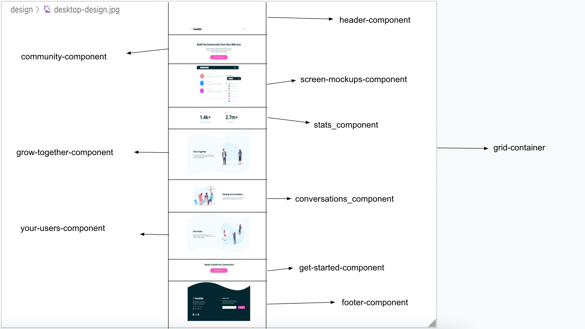
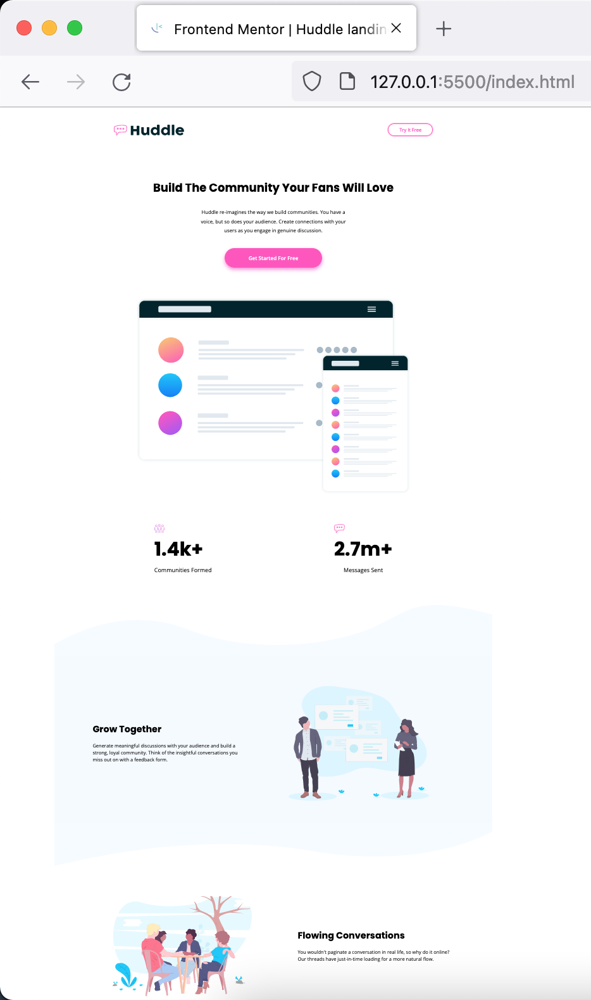
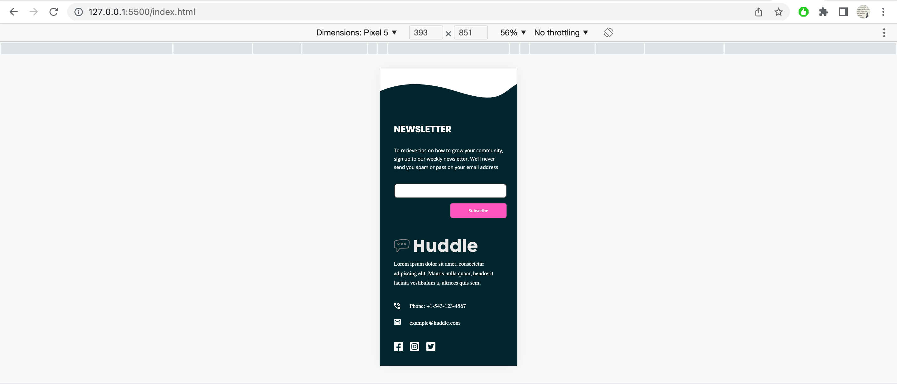

# Frontend Mentor - Huddle landing page with curved sections solution

This is a solution to the [Huddle landing page with curved sections challenge on Frontend Mentor](https://www.frontendmentor.io/challenges/huddle-landing-page-with-curved-sections-5ca5ecd01e82137ec91a50f2). Frontend Mentor challenges help you improve your coding skills by building realistic projects.

## Table of contents

- [Overview](#overview)
  - [The challenge](#the-challenge)
  - [Screenshot](#screenshot)
  - [Links](#links)
- [My process](#my-process)
  - [Built with](#built-with)
  - [What I learned](#what-i-learned)
  - [Continued development](#continued-development)
  - [Useful resources](#useful-resources)
- [Author](#author)
- [Acknowledgments](#acknowledgments)

## Overview

This is 13th project from "Frontend Mentor" to sharpen HTML & CSS skills along with responsive web design and it's build with "BEM", "Grid & Flexbox layout", "min-width, max-width & width in % trial & error".

### The challenge

Users should be able to:

- View the optimal layout for the site depending on their device's screen size
- See hover states for all interactive elements on the page

### Screenshot

### Links

- [Live Website](https://vikramvi.github.io/Huddle-landing-page-with-curved-sections/)

## My process

- "Little victories lead to bigger victories, that affect the battles that eventually win wars"
- Chop down big problem / task to smallest one possible and start solving / finishing one after another.

### Built with

- Semantic HTML5 markup
- BEM
- Mobile-first workflow
- CSS Grid
- Flexbox
- min-width, max-width & width in % trial + errors
- Chrome and FF Dev Tools

### What I learned

- learning more about width, max-width & min-width techniques
- Grid & Flex usages
- Background image, color positioning
- How to make pixel perfect mobile & desktop layouts

### Continued development

- Learn more about semantic HTML for better SEO, Accessibility purposes
- CSS techniques to build websites faster with less bugs and refactoring needed

### Useful resources

- Frontend Mentor slack community + website
- YT videos
- Google ofcourse
- Stackoverflow
- Twitter dev community

## Author

- Frontend Mentor - [@vikramvi](https://www.frontendmentor.io/profile/vikramvi)

## Acknowledgments

- Frontend Mentor slack community
- YT content creators
- Google + SO communi
